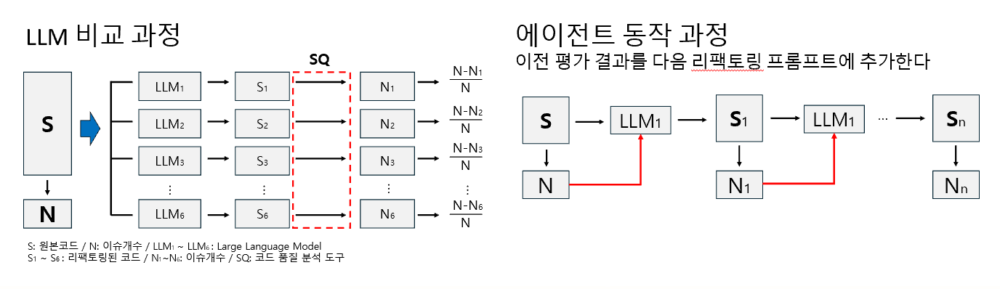

# LLM을 활용한 SW Refactoring

## 1. 프로젝트 배경

### 1.1. 국내외 시장 현황 및 문제점
소프트웨어의 전체 생명주기에서 가장 많은 비용과 시간을 차지하는 단계는 개발이 아닌 유지보수이다. 전체 비용의 50~80% 부분이 소프트웨어가 최초로 배포된 이루의 수정, 개선, 적응 과정에서 발생하는 것으로 알려져 있다. [1]

낮은 유지보수성을 가진 코드는 흔히 기술 부채(Technical Debt)를 유발한다. 복잡하게 얽힌 코드(높은 결합도), 불분명한 구조, 문서의 부재 등은 당장의 기능 구현에는 문제가 없을지라도, 시간이 지남에 따라 사소한 변경에도 예기치 않은 버그를 발생시키고 개발 속도를 저하시킨다.

기존 리팩토링 도구는 규칙 기반으로 동작하여 대규모 프로젝트나 복잡한 로직에서 자동화의 한계가 분명히 드러난다. 최근 대형언어모델 기반 개발 지원(Copilot 등)이 보편화되고 있지만, C언어 대형 프로젝트에 대해 품질 중심의 자동 리팩토링과 오픈소스 연동 사례는 부족하다.

### 1.2. 필요성과 기대효과
- **필요성**: 
    - 유지보수성 악화·코드 누적 이슈·빌드 실패·보안 취약점을 자동 진단하고, LLM을 이용한 개선으로 기술부채를 줄일 필요가 있다. 
    - 소규모/대규모 프로젝트 모두에 적용 가능해야 하며, 코드 컨텍스트와 빌드 성공까지 자동으로 보장할 수 있어야 한다.
- **기대효과**: 
   - 개발자 리팩토링 부담 경감 및 품질 개선의 자동화 구현
   - SonarCloud 등 외부 품질 플랫폼과 연동 통한 실질적 품질 수치 개선
   - 빌드 자동 검증 및 커밋 이력 관리로 대규모 협업과 오픈소스 유지보수의 부담 감소

## 2. 개발 목표

### 2.1. 목표 및 세부 내용
- SonarCloud 정적 분석 기반으로 C 코드의 Blocker/Critical 이슈 자동 검출·수정
- LLM(예: GPT-5, Gemini-2.5-pro, Claude-Opus-4-1) 기반 코드 컨텍스트 리팩토링
- 빌드 테스트와 오류 검출, 수정 루프 내장(에러까지 반복적 자동 대응)

### 2.2. 기존 서비스 대비 차별성
- 기존 규칙 기반 리팩토링 도구 대비, 코드 흐름과 컨텍스트를 이해하는 LLM의 적용
- 빌드 오류까지 실시간 자동 추적·대응하는 워크플로우
- SonarCloud 외부 분석 플랫폼 연동, 품질 데이터 투명화(지표 기반 개선 추적)
- C전용, 대형 프로젝트 검증 (기존 서비스는 주로 Java, Python, JavaScript/TypeScript에 치중)

### 2.3. 사회적 가치 도입 계획
- 오픈소스 코드 품질 저변 확대, 유지보수성 향상
- 자동화 통한 개발자 생산성 증대와 기술부채 감소

## 3. 시스템 설계

### 3.1. 시스템 구성도
LLM 기반 SW 리팩토링 에이전트 전체 아키텍처는 다음과 같습니다:

<!---TODO--->

### 3.2. 사용 기술
- **Frontend**: Streamlit
- **Backend**: Python, Clang
- **AI**: Langchain, OpenAI(GPT-5), Google Gemini, Anthropic Claude
- **Database**: SQLite
- **Static analysis**: SonarCloud

## 4. 개발 결과

### 4.1. 전체 시스템 흐름도
사용자가 지정한 프로젝트의 issue를 SonarCloud를 통해 수집하고 주요 이슈만 추출한다. 프로젝트의 시그니처/컨텍스트를 추출한 후, LLM을 통해 코드를 리팩토링한다. 이후 빌드 메시지를 통해 수정하고 파이프라인을 통해 Git에 저장한 후 log와 대시보드 사용자에게 보여준다.

### 4.2. 기능 설명 및 주요 기능 명세서
1. 정적 분석 이슈 수집
- 입력 (Input):
    - SonarCloud 관련 key
- 처리 과정 (Process):
    - 해당 프로젝트의 SonarCloud에서 분석한 이슈들을 가져온다.
- 출력 (Output):
    - 이슈들 중 필요한 정보만 필터링한 것 

2. 프로젝트 컨텍스트 생성
- 입력 (Input):
    - 프로젝트 위치, GitHub 관련 key
- 처리 과정 (Process):
    - Clang을 이용한 파서로 함수·타입 시그니처/컨텍스트를 파싱
- 출력 (Output):
    - 각 파일별 컨텍스트
3. LLM 리팩토링
- 입력 (Input):
    - SonarCloud issue: 프로젝트의 주요 이슈 정보들
    - context: 파싱한 프로젝트 시그니처/컨텍스트
- 처리 과정 (Process):
    - SonarCloud issue와 프로젝트 컨텍스트로 코드 리팩토링을 수행한다.
- 출력 (Output):
    - 커밋 메시지 생성을 위한 diff

### 4.3. 디렉토리 구조
```
./
├── 📜requirements.txt              # Python 패키지 의존성
├── 📜 agent_activity.db          # agent 활동 기록
├── ⚙️ .env                       # 환경변수 설정 파일
└── 📂 src/
    ├── 📂 parser/                    # C 코드 파싱 모듈
    ├── 📂 limiter/                   # LLM 호출 제한 관리 모듈
    ├── main.py                    # main agent 
    └── ...       
```

## 5. 설치 및 실행 방법

### 5.1. 설치절차 및 실행 방법
- Python 3.10+, Docker, Git, 등 환경 필요
- Docker 실행
- `.env` 파일 작성 후 아래 절차 실행

```bash
pip install -r requirements.txt
python .\src\main.py
streamlit run .\src\dashboard.py --server.port <PORT>
```

### 5.2. 오류 발생 시 해결 방법
- SonarCloud API Key/Organization/ProjectKey 누락 시 에이전트가 실행되지 않음 (환경변수 확인)
- 빌드 에러: 로그파일 확인 및 도커 설정 체크
- Git 인증 문제: GITHUB_PAT_KEY 토큰/권한 확인


## 6. 소개 자료 및 시연 영상
### 6.1. 프로젝트 소개 자료
[발표 자료](docs/03.발표자료/발표자료.pptx)
### 6.2. 소개 영상
[](https://youtu.be/mbzhsrA5UJg?si=F1sI35B77A5FMBBk)

## 7. 팀 구성
### 7.1. 팀원별 소개 및 역할 분담
#### 김병현
- 변인 통제 기반 실험: 
    - LLM 모델, LOC, CC 등 다양한 변수에 따라 리팩토링 성능이 어떻게 변화하는지 체계적으로 실험하고 데이터를 수집
- 결과 데이터 시각화 및 해석: 
    - 수집된 데이터를 그래프로 시각화하고, "2000 LOC 임계점", "저복잡도 코드에서의 품질 저하 현상" 등 LLM의 성능 특성에 대한 심도 있는 분석을 통해 연구의 결론을 도출

#### 박준하
- Agent 설계 구성:
    - LLM 리팩토링 agent를 구현하여 정적 분석 - 리팩토링 - 빌드 검증의 자동화된 파이프라인으로 연결하고 빌드 오류 기반 재시도와 컨텍스트 증강 등의 안정적인 연속 개선 절차를 정착
- 변인 통제 기반 실험
    - LLM 모델별로 구현된 agent를 사용하여 프로젝트 단위의 리팩토링 성능이 어떻게 변화하는지 실험하고 데이터를 수집

### 7.2. 팀원 별 참여 후기
> 개별적으로 느낀 점, 협업, 기술적 어려움 극복 사례 등
#### 김병현 
- 프로젝트를 통해 느낀 점

    단순히 ‘개선이 좋아졌다'가 아니라, SonarQube라는 산업 표준 도구를 통해 '유지보수성 개선율'이라는 정량적 지표로 성능을 측정하고 분석하는 과정이 기억에 남는다. 특히 코드의 LOC나 CC 같은 특성이 LLM 성능에 비선형적인 영향을 미치는 '임계점'을 발견했을 때, 데이터를 깊이 있게 분석하고 인사이트를 도출하는 값진 경험을 하였다. 

- 협업 경험

    협업하는 과정에서 동일한 실험 환경 구축, 효율적인 작업 배분 등을 위한 적극적인 소통의 중요성을 느꼈다. 

- 기술적 어려움 및 극복 사례

    LLM이 매번 동일한 목표를 가지고 일관된 작업을 수행하도록, 'C언어 리팩토링 전문가'라는 명확한 역할을 부여하고 SonarQube의 규칙을 기반으로 구체적인 리팩토링 가이드라인을 제시하는 일관된 프롬프트를 설계했다.

#### 박준하
- 파이프라인을 유기적으로 연결했을 때, 수작업 반복을 줄이면서도 품질 개선을 빠르게 피드백받는 개발 경험을 체감할 수 있었다. 파서로 컨텍스트를 추출해 LLM에 주입하니 의미 있는 리팩토링이 효과적으로 진행되었다.
- 협업하는 과정에서 조율과 의사소통의 중요성을 느꼈다. 
- 모델 구조화 출력 차이로 초기 호환성 이슈가 있었지만 공통 인터페이스를 두어 안정적으로 JSON 파싱을 확보했다.


## 8. 참고 문헌 및 출처
[1] The true cost equation: Software development and maintenance costs explained, https://idealink.tech/blog/software-development-maintenance-true-cost-equation, 2025년 5월 7일

---